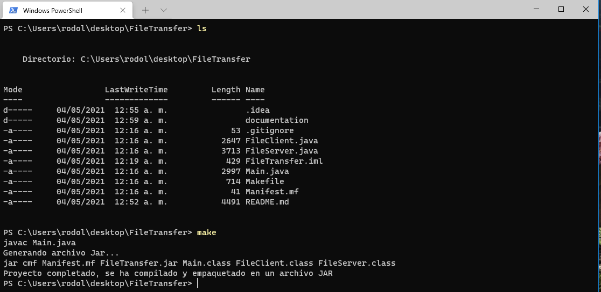

# FileTransfer
## ¿Qué es FileTransfer?
FileTransfer es un pequeño programa escrito en Java (concretamente java 11) que permite la transferencia de ficheros fácilmente a través de la red.

El objetivo principal de FileTransfer es la posibilidad de poder transferir ficheros de manera muy sencilla a través de la red sin muchas complicaciones, solo basta con especificar la dirección del host y el fichero que se desea transferir.

Para que ocurra la “magia” se necesitan dos piezas claves, el cliente (que es el host que especificara el fichero a transferir) y el servidor (el host que está a la escucha y espera del fichero que se le transferirá) 

### El caso de uso principal a este proyecto es el siguiente: 
La transferencia de ficheros entre dos computadoras dentro de la misma red local, de esta manera dejando de lado la transferencia tediosa a través de USB, configuración de un servidor FTP o tener que subir el fichero a la nube  para su posterior descarga en la computadora de destino. El poder transferir el fichero a través de la misma red local brinda la posibilidad de usar la velocidad máxima posible dentro de tu red LAN, la cual no se ve limitada por el ancho de banda de tu proveedor de Internet (el cual no tiene poder aquí).    


## Compilación del proyecto
En la carpeta del proyecto se encuentra un archivo Makefile, para poderlo ejecutar se deberá tener instalado previamente esta herramienta (Makefile está disponible tanto para Linux como para windows).

Solo basta con abrir la terminal en la raíz del proyecto, escribir la palabra “make” y dar enter para que se inicie la compilación y empaquetado del proyecto, dando como resultado un archivo jar complemente funcional.

</br>



</br>

## Uso de FileTransfer
Tanto el servidor como el cliente se encuentran “empaquetados” dentro del mismo archivo jar, esto con la finalidad de tener todo integrado en un solo archivo. 

Para iniciar el servidor o cliente solo basta con especificarlo de la siguiente manera desde la terminal:

Inicio del servidor

```bash
java -jar FileTransfer.jar --server [port]
```

>“port” como su nombre lo indica, hace referencia al número de puerto al que estará escuchando el programa, si no se especifica un puerto se utilizará el *1921* como predeterminado.


Inicio del cliente

```bash
java -jar FileTransfer.jar host@port@file_path
```

>“host” hace referencia a la dirección del host servidor, por ejemplo: 192.180.168.132, “port” el número de puerto que el servidor está escuchando y “file_path” hace referencia a la dirección del fichero que se quiera transferir, ejemplo: c://users/user/desktop/video.mp4

</br>
</br>

### Nota importante:
Este proyecto solamente está desarrollado como un mero hobbit y hasta cierto punto con fines educativos, no se recomienda su uso con host fuera de la red local debido a la falta de seguridad en la transferencia de datos.
